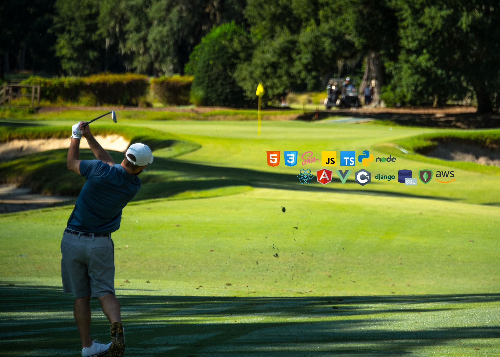

</img>

# Welcome to my Github Profile 👋

## Full Stack Software Developer

### Socials
    
<a target='_blank' rel="noreferrer" href='https://www.linkedin.com/in/wthomascrowe'>LinkedIn</a>
<a target='_blank' rel="noreferrer" href="https://www.facebook.com/tcrowe4">Facebook</a>
<a target='_blank' rel="noreferrer" href="https://www.instagram.com/wtcrowe4">Instagram</a>
<a target='_blank' rel="noreferrer" href="https://twitter.com/wtcrowe4">Twitter</a>

<!--
**wtcrowe4/wtcrowe4** is a ✨ _special_ ✨ repository because its `README.md` (this file) appears on your GitHub profile.

Here are some ideas to get you started:

- 🔭 I’m currently working on ...
- 🌱 I’m currently learning ...
- 👯 I’m looking to collaborate on ...
- 🤔 I’m looking for help with ...
- 💬 Ask me about ...
- 📫 How to reach me: ...
- 😄 Pronouns: ...
- ⚡ Fun fact: ...
-->
